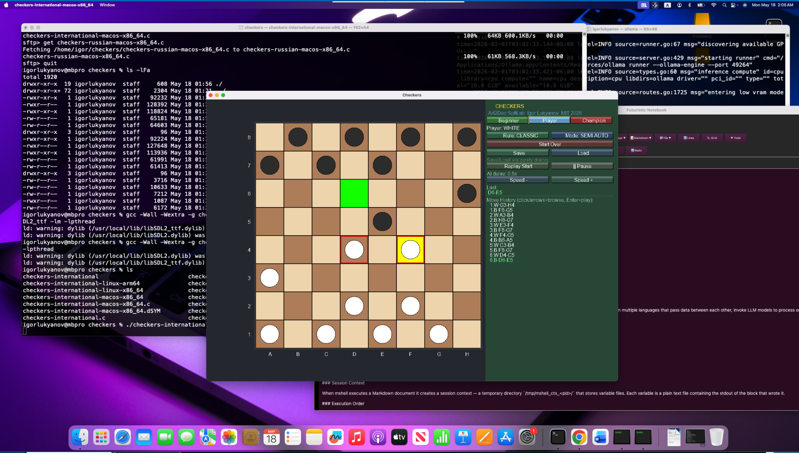

# Checkers (SDL2, C)

Two versions of the classic board game written in C using SDL2:
**Russian Checkers** (traditional rules) and **International Checkers** (full international rules).
Features AI opponent with three difficulty levels, game replay, position analysis, and save/load.

**Project**: Art2Dec SoftLab | **Author**: Igor Lukyanov | **License**: MIT | **Year**: 2026

---

## Screenshots

### Ubuntu 24 (Intel Core i7 / x86_64)


### Raspberry Pi (ARM64 / Debian)


### macOS Sequoia (Intel x86_64)


---

## Two Versions

### Russian Checkers (`checkers-russian`)

Traditional 8×8 Russian checkers rules:

- **Objective**: capture all opponent pieces or block all their moves.
- **Movement**: men move diagonally **forward only** (one square).
- **Captures**: men capture diagonally **forward only**; captures are mandatory.
- **Multi-jump**: chain captures supported — must continue if further captures available.
- **Kings**: move and capture diagonally **one square** in all four directions.
- **Promotion**: man reaching the last rank becomes a king immediately.
- **Giveaway mode**: objective reversed — lose all your pieces or get completely blocked.

### International Checkers (`checkers-international`)

Full international draughts rules on 8×8 board:

- **Objective**: capture all opponent pieces or block all their moves.
- **Movement**: men move diagonally **forward only** (one square).
- **Captures**: men capture diagonally in **all four directions** (including backward); mandatory.
- **Multi-jump**: chain captures supported for both men and kings.
- **Kings (Flying Kings)**: move any number of squares diagonally in all four directions
  (like a bishop in chess) — until blocked by a piece or the board edge.
- **King captures**: king flies along the diagonal, captures any enemy piece found,
  and may land on **any empty square beyond** the captured piece.
  If further captures are possible from the landing square, they must be taken.
- **Promotion**: man reaching the last rank becomes a king. If the king can
  immediately continue capturing, it must do so.
- **Giveaway mode**: objective reversed — lose all your pieces or get completely blocked.

> **Key difference from Russian rules**: in International Checkers, men capture backward,
> kings fly across the board, and kings land on any square behind the captured piece —
> not just the immediately adjacent one. This creates far richer tactical combinations.

---

## Features

### Play Modes

- **Manual** — player controls both sides manually.
- **Semi-Auto** — player moves White; computer moves Black.
- **Full-Auto** — computer plays both sides (demo / analysis).

### AI Difficulty Levels

Three levels selectable via the **[Beginner] [Player] [Champion]** buttons:

- **Beginner** — plays a random legal move. Good for learning.
- **Player** — uses **Minimax** algorithm at depth 2. Looks 2 half-moves ahead,
  evaluates by material count, advancement, and center control.
- **Champion** — uses **Minimax with Alpha-Beta pruning** at depth 4.
  Examines 4 half-moves ahead. Alpha-Beta cuts irrelevant branches,
  making the search roughly 10–20× faster and equivalent to depth ~8 in practice.

> **Minimax** assumes both sides play optimally — the computer maximises its score
> while minimising the opponent's. **Alpha-Beta pruning** skips branches that
> cannot affect the final decision.

### Mandatory Capture Highlight

When a capture is mandatory, the piece(s) that must capture are highlighted
with a **blinking red border** — so you never miss a forced move.

### Move History & Analysis

- **Scrollable move history** panel with human-readable notation (`G3-H4`, `E5xC3`).
- **Browse Mode** — click any move in the list to view the board at that position.
  Navigate with `↑`/`↓` arrow keys. Press `Enter` to play from there.
- **Replay Start** — automated step-by-step replay from the beginning.
- **Replay from here** — start replay from any selected move in history.
- **Play from here** — continue the game from any historical position.

### Save / Load

- Save and load games as plain `.txt` files via native file dialog (Zenity on Linux/macOS).
- Each saved move includes the **full board state** (64-cell snapshot) —
  any position is restored instantly without replaying the entire game.
- File stores: rule mode, play mode, AI level, move speed, and all moves with board snapshots.

### Save File Format

```
CHECKERS_GAME
RULE_MODE 0
PLAY_MODE 1
AI_LEVEL 1
SPEED 500
MOVES 42
MOVE G3-H4 0303030330303030030300030000003000000001101010000101010110101010 1
MOVE F6-G5 0303030330303030030300000000003030000001101010000101010110101010 0
...
```

Each `MOVE` line: notation + 64 digits (0=empty, 1=white man, 2=white king,
3=black man, 4=black king) + player to move (0=White, 1=Black).

### Window & Layout

- **Resizable window** — board, pieces, and panels adapt dynamically.
- Color-coded move highlighting: **cyan** = browse, **orange** = replay, **lime** = last move.

---

## Build Instructions

### Linux (Ubuntu / Debian — x86_64 and ARM64)

Install dependencies:

```sh
sudo apt-get install build-essential libsdl2-dev libsdl2-ttf-dev zenity fonts-dejavu-core
```

Compile:

```sh
# International rules
gcc -Wall -Wextra -g checkers-international.c -o checkers-international \
    -lSDL2 -lSDL2_ttf -lm -lpthread

# Russian rules
gcc -Wall -Wextra -g checkers-russian.c -o checkers-russian \
    -lSDL2 -lSDL2_ttf -lm -lpthread
```

Run:

```sh
./checkers-international
./checkers-russian
```

### macOS Sequoia (Intel x86_64)

Install dependencies via [Homebrew](https://brew.sh):

```sh
brew install sdl2 sdl2_ttf zenity
```

Compile:

```sh
# International rules
gcc -Wall -Wextra -g checkers-international.c -o checkers-international \
    $(sdl2-config --cflags --libs) -lSDL2_ttf -lm -lpthread

# Russian rules
gcc -Wall -Wextra -g checkers-russian.c -o checkers-russian \
    $(sdl2-config --cflags --libs) -lSDL2_ttf -lm -lpthread
```

Run:

```sh
./checkers-international
./checkers-russian
```

> **Apple Silicon (M1/M2/M3/M4)**: the same source code compiles on ARM64 macOS —
> you are welcome to build it! Use the same commands above; Homebrew on Apple Silicon
> uses `/opt/homebrew` instead of `/usr/local`, but `sdl2-config` handles that automatically.

---

## Pre-built Binaries

| Platform | International | Russian |
|----------|--------------|---------|
| Linux x86_64 (Ubuntu/Debian) | `checkers-international-linux-x86_64` | `checkers-russian-linux-x86_64` |
| Linux ARM64 (Raspberry Pi / Debian) | `checkers-international-linux-arm64` | `checkers-russian-linux-arm64` |
| macOS Sequoia Intel x86_64 | `checkers-international-macos-x86_64` | `checkers-russian-macos-x86_64` |

Download the binary for your platform, make it executable and run:

```sh
chmod +x checkers-international-linux-x86_64
./checkers-international-linux-x86_64
```

---

## Controls

### Mouse
- **Left-click** piece → select it (selected piece highlighted in green).
- **Left-click** destination square → move.
- **Scroll wheel** over move history → scroll the list.
- **Click** move in history → browse to that position.
- **Click** UI buttons → Start Over, Save, Load, Replay, AI level, Speed.

### Keyboard
- `↑` / `↓` — navigate moves in browse mode.
- `Enter` — play from current browse position.
- `Esc` — exit browse mode.

---

## Project Structure

```
checkers-international.c              — International rules source
checkers-russian.c                    — Russian rules source
checkers-international-linux-x86_64  — Linux x86_64 binary (International)
checkers-international-linux-arm64   — Linux ARM64 binary (International)
checkers-international-macos-x86_64  — macOS Intel binary (International)
checkers-russian-linux-x86_64        — Linux x86_64 binary (Russian)
checkers-russian-linux-arm64         — Linux ARM64 binary (Russian)
checkers-russian-macos-x86_64        — macOS Intel binary (Russian)
game-beginner.txt                     — example saved game (Beginner AI)
game-player.txt                       — example saved game (Player AI)
game-champion.txt                     — example saved game (Champion AI)
screenshots/
  checkers-ubuntu-x86_64.png
  checkers-debian-arm64.png
  checkers-macos-x86_64.png
README.md
LICENSE
```

---

## Contributing

1. Fork the repository.
2. Create a feature branch: `git checkout -b feature/my-improvement`
3. Build with the gcc commands above and verify no errors or warnings.
4. Submit a pull request with a clear description.

Bug reports welcome — please include OS, SDL2 version, and steps to reproduce.

---

## License

MIT License — Copyright (c) 2026 Igor Lukyanov, Art2Dec SoftLab

Permission is hereby granted, free of charge, to any person obtaining a copy of this software
and associated documentation files (the "Software"), to deal in the Software without restriction,
including without limitation the rights to use, copy, modify, merge, publish, distribute,
sublicense, and/or sell copies of the Software, and to permit persons to whom the Software is
furnished to do so, subject to the following conditions:

The above copyright notice and this permission notice shall be included in all copies or
substantial portions of the Software.

THE SOFTWARE IS PROVIDED "AS IS", WITHOUT WARRANTY OF ANY KIND, EXPRESS OR IMPLIED.
