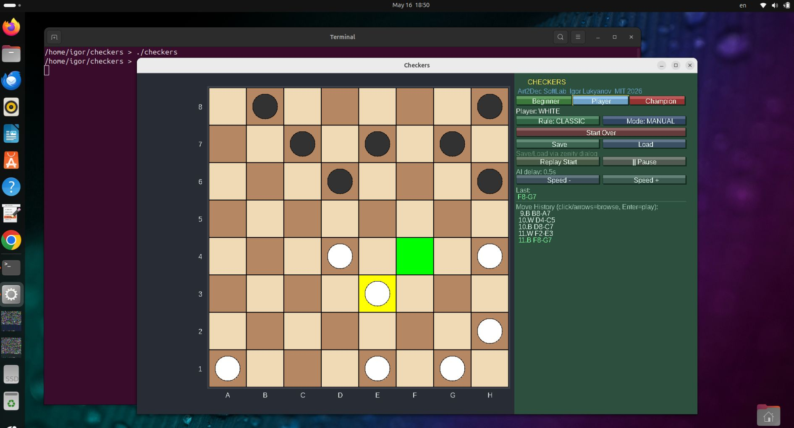
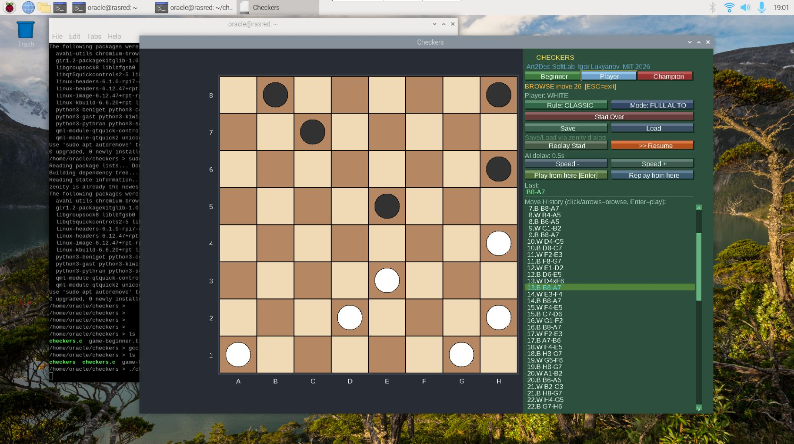

# Checkers (SDL2, C)

A desktop Checkers game written in C using SDL2, featuring both Classic and Giveaway rules,
multiple play modes, AI opponent with three difficulty levels, and a rich move history interface.

**Project**: Art2Dec SoftLab | **Author**: Igor Lukyanov | **License**: MIT | **Year**: 2026

---

## Screenshots

### Ubuntu 24 (Intel Core i7 / x86_64)


### Raspberry Pi (ARM64 / Debian)


---

## Features

### Rule Sets

- **Classic Checkers** — capture all opponent pieces or block all their moves.
  Mandatory captures enforced. Multi-jump captures supported.
  Promotion to **king** on reaching the last rank.
  Kings move and capture diagonally in all four directions.

- **Giveaway Checkers** (Suicide / Anti-checkers) — objective is to **lose** all
  your pieces or become completely blocked. Same movement and king rules as Classic.
  Mandatory captures still enforced.

### Play Modes

- **Manual** — player performs all moves manually.
- **Semi-Auto** — player moves White; computer moves Black.
- **Full-Auto** — computer plays both sides (demo / analysis).

### AI Difficulty Levels

Three levels selectable via the **[Beginner] [Player] [Champion]** buttons:

- **Beginner** — plays a random legal move. Easy to beat, good for learning.
- **Player** — uses Minimax algorithm with depth 2. Looks 2 half-moves ahead,
  evaluates position by material, advancement, and center control.
- **Champion** — uses Minimax with **Alpha-Beta pruning** at depth 4.
  Examines up to 4 half-moves ahead. Alpha-Beta cuts irrelevant branches,
  making it equivalent to depth ~8 in practice. Plays strong tactical moves.

> **Minimax** — a game-tree algorithm that assumes both sides play optimally.
> The computer maximises its own score while minimising the opponent's.
> **Alpha-Beta pruning** skips branches that cannot affect the final decision,
> making the search roughly 10–20× faster.

### Move History & Analysis

- **Scrollable move history** panel with human-readable notation (e.g. `G3-H4`, `E5xC3`).
- **Browse Mode** — click any move in the list to view the board at that position.
  Navigate with arrow keys. Press `Enter` to play from there.
- **Replay** — automated step-by-step replay from the start or from any selected move.
- **Replay from here** — start replay from a chosen move in the history.
- **Play from here** — start a new game from any historical position.

### Save / Load

- Save and load games as plain `.txt` files via native file dialog (Zenity).
- Each saved move includes the **full board state** (64-cell snapshot) —
  any position can be restored instantly without replaying the entire game.
- File stores: Rule mode, Play mode, AI level, Move speed, and all moves with board snapshots.
- Human-readable format, suitable for version control.

### Save File Format

```
CHECKERS_GAME
RULE_MODE 0
PLAY_MODE 1
AI_LEVEL 1
SPEED 500
MOVES 42
MOVE G3-H4 0303030330303030030300030000003000000001101010000101010110101010
MOVE F6-G5 0303030330303030030300000000003030000001101010000101010110101010
...
```

Each `MOVE` line contains the notation followed by 64 digits representing the board
(0=empty, 1=white man, 2=white king, 3=black man, 4=black king), row by row left to right.

### Window & Layout

- **Resizable window** — board, pieces, and panels adapt dynamically.
- Scrollable move list with scrollbar (click arrows or track to jump).
- Color-coded move highlighting: **cyan** = browse position, **orange** = replay position,
  **lime** = last played move.

---

## Build Instructions

### Requirements

```sh
sudo apt-get install build-essential libsdl2-dev libsdl2-ttf-dev zenity fonts-dejavu-core
```

### Compile

```sh
gcc -Wall -Wextra -g checkers.c -o checkers -lSDL2 -lSDL2_ttf -lm -lpthread
```

### Run

```sh
./checkers
```

---

## Pre-built Binaries

| Platform | Binary |
|----------|--------|
| Linux x86_64 (Ubuntu) | `checkers-linux-x86_64` |
| Linux ARM64 (Raspberry Pi / Debian) | `checkers-linux-arm64` |

Download the binary for your platform, make it executable and run:

```sh
chmod +x checkers-linux-x86_64
./checkers-linux-x86_64
```

---

## Controls

### Mouse
- **Left-click** piece → select it.
- **Left-click** destination square → move.
- **Scroll wheel** over move history → scroll the list.
- **Click** move in history → browse to that position.
- **Click** UI buttons → Start Over, Save, Load, Replay, AI level, Speed.

### Keyboard
- `↑` / `↓` — navigate moves in browse mode.
- `Enter` — Play from current browse position.
- `Esc` — exit browse mode.

---

## Project Structure

```
checkers.c              — full source (single file)
checkers-linux-x86_64  — binary for Ubuntu/Debian x86_64
checkers-linux-arm64   — binary for Raspberry Pi ARM64
game-beginner.txt       — example saved game (Beginner AI)
game-player.txt         — example saved game (Player AI)
game-champion.txt       — example saved game (Champion AI)
README.md
```

---

## Contributing

1. Fork the repository.
2. Create a feature branch: `git checkout -b feature/my-improvement`
3. Build with the gcc command above and verify it compiles without errors.
4. Submit a pull request with a clear description.

Bug reports welcome — please include OS, SDL2 version, and steps to reproduce.

---

## License

MIT License — Copyright (c) 2026 Igor Lukyanov, Art2Dec SoftLab

Permission is hereby granted, free of charge, to any person obtaining a copy of this software
and associated documentation files (the "Software"), to deal in the Software without restriction,
including without limitation the rights to use, copy, modify, merge, publish, distribute,
sublicense, and/or sell copies of the Software, and to permit persons to whom the Software is
furnished to do so, subject to the following conditions:

The above copyright notice and this permission notice shall be included in all copies or
substantial portions of the Software.

THE SOFTWARE IS PROVIDED "AS IS", WITHOUT WARRANTY OF ANY KIND, EXPRESS OR IMPLIED.
